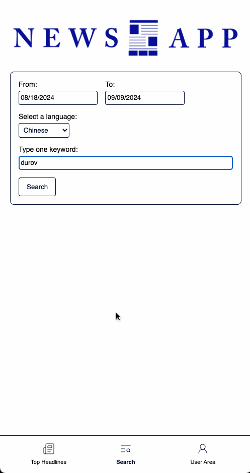

# News App

## Running the project

1. Clone the project.
2. Run `npm install`
3. Create a `.env.local` file.

```
{
GITHUB_ID=""
GITHUB_SECRET=""
NEXT_PUBLIC_OPENAI_API_KEY=""
}
```

Now run the server:

```
npm run dev
```

Open [http://localhost:3000](http://localhost:3000) with your browser to see the result.

## Overview

A mobile app that allows to research and save news articles based on the News API [https://newsapi.org/](https://newsapi.org/)

## Features

-   Carousel with the headlines of the day for several countries
-   Search function for news articles
-   Login and profile page
-   Favorite articles
-   OpenAI-based translation 

## Technologies

|                                                                                                                       |           |                                                                                                |            |
| --------------------------------------------------------------------------------------------------------------------- | --------- | ---------------------------------------------------------------------------------------------- | ---------- |
| [](https://developer.mozilla.org/en-US/docs/Web/CSS)      | CSS       | [](https://developer.mozilla.org/en/JavaScript) | Javascript |
| [](https://react.dev/)                                  | React     | []([https://nodejs.org/en](https://nextjs.org/))      | Next.js  

## Preview
### Carousel: Headlines Of The Day


### Search Articles


### Login


### Favorites


### Translate Articles



